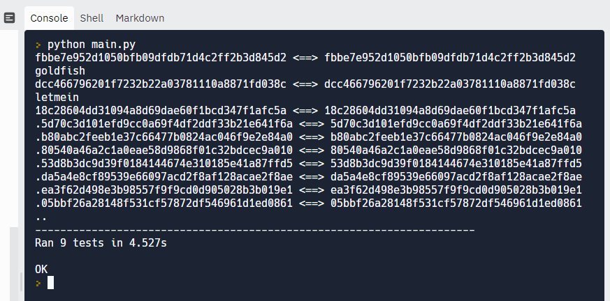

# SHA-1 Password Cracker

hashlib.sha1 and hashlib.md5 are inherently weak.  In fact, hackers has compiled lists of frequently guessed passwords called the Rainbow Tables.  One can convert each of these passwords into hash.sha1 and use it to compare with the hash objects stored in password database.  Often with surprisingly high match rate.


## How to hack a passord

A note about SHA-1, MD-5.  They are not encryption algorithms!  Rather, they are hashing functions which is one-way ticket simply impossible to revert.

The use case for hashing is mainly for authentication, given an original object (password, file, image, etc), the content is hashed into SHA1, or MD5, else and stored in database.  So, even the application could not revert a given hashed object to its original content.
To authenticate, the user will supply an original object {password, file, image, etc}.  the same hash routine is applied to produce a hashed object.  This hashed object is compared with one stored in the database looking for a match.


## Replit output

This solution can be mapped to Replit for demo.
(freecodecamp -- Information Security Projects)[https://www.freecodecamp.org/learn/information-security/information-security-projects/sha-1-password-cracker]


Below is the runtime output from Replit.




## Repository 

I just keep the command lines here for my own interest.  Don't mind me.

```
create a new repository on the command line
echo "# SHA-1-Password-Cracker" >> README.md
git init
git add README.md
git commit -m "first commit"
git branch -M main
git remote add origin https://github.com/hurricanemark/SHA-1-Password-Cracker.git
git push -u origin main
```
